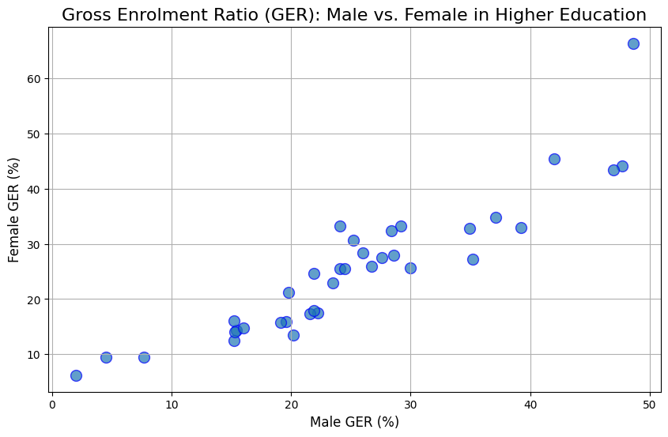
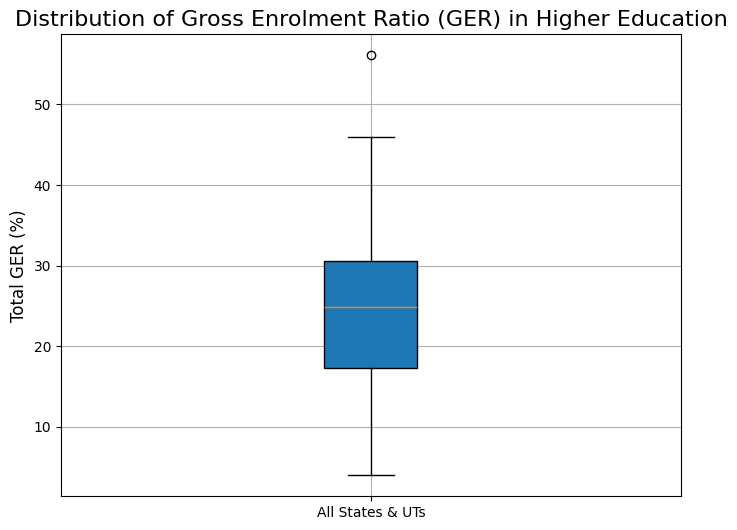
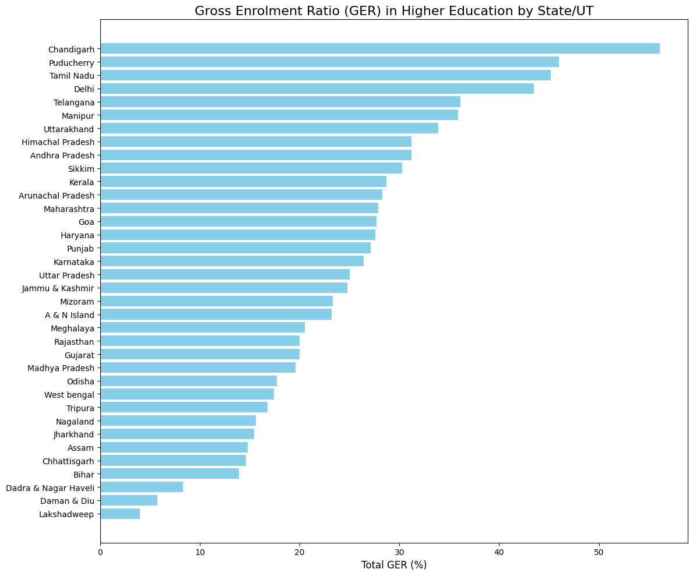

# Analysis of Gross Enrolment Ratio (GER) in Indian Higher Education

This project analyzes the Gross Enrolment Ratio (GER) in higher education across different states and union territories in India. The analysis is based on state-wise GER data and visualizes comparisons between male and female enrolment, the overall distribution of GER, and a state-by-state breakdown.

## Data Source

The dataset used for this analysis is from data.gov.in:

* **Dataset:** State-wise Gross Enrolment Ratio (GER) in Higher Education
* **Source URL:** [URL](https://www.data.gov.in/resource/state-ut-wise-gross-enrolment-ratio-higher-education-2001-02-2014-15)
* **Citation:** Ministry of Human Resource Development, Department of Higher Education.

## Plots and Analysis

### 1. Scatter Plot: Male vs. Female GER

* **Observation:** This scatter plot shows the relationship between the GER of males and females in higher education for each state/UT. A positive correlation is visible, indicating that states with higher male GER also tend to have higher female GER. Most points are clustered around a line, suggesting a somewhat balanced enrolment ratio in many states, though there are outliers.

### 2. Box Plot: Distribution of Total GER

* **Observation:** This box plot displays the distribution of the total GER across all states and UTs. It helps to quickly see the median, quartiles, and range of the data. We can identify the median GER and observe the spread of GER percentages, which indicates the level of disparity in higher education enrolment across the country.

### 3. Bar Plot: GER by State/UT

* **Observation:** This horizontal bar plot ranks the states and UTs by their total GER in higher education. This visualization makes it easy to compare the performance of different regions. States at the top of the chart have a higher GER, indicating better enrolment rates in higher education, while states at the bottom have lower rates. This highlights regional disparities in access to and participation in higher education.
